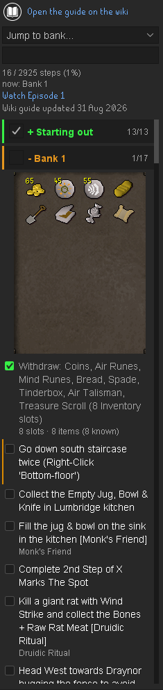
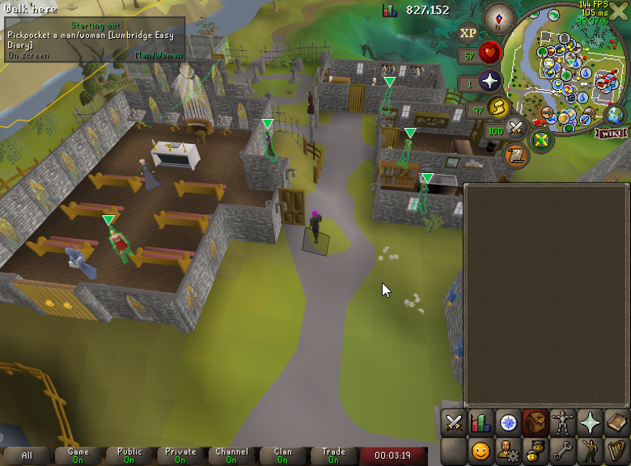
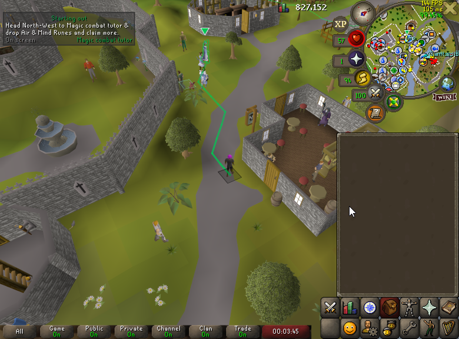
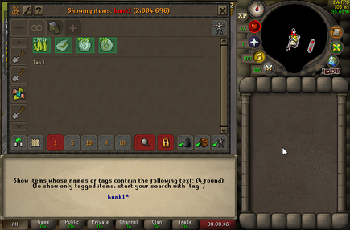
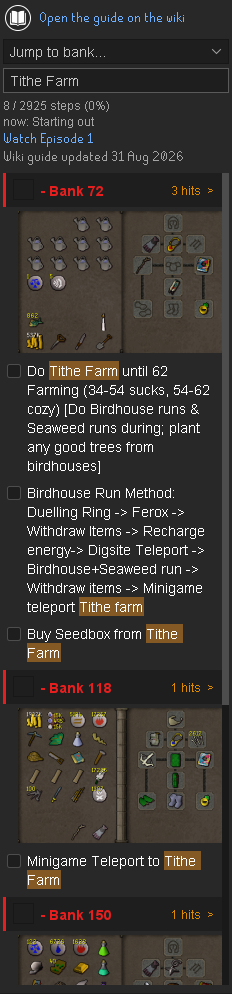

# B0aty HCIM Guide v3

Follows [B0aty's HCIM Guide V3][guide] in game. The plugin is a checklist
first: every bank and step in the sidebar, with the step you are on
highlighted in the world.

[guide]: https://oldschool.runescape.wiki/w/Guide:B0aty_HCIM_Guide_V3

*Every bank and step, with the setup image for the bank you are on.*

## Using it

The guide icon appears in the RuneLite sidebar. Steps are ticked by clicking
them, and the bank you are on stays in view as you go. The current step's NPC
or object is outlined in the world with an arrow above it, a route drawn to
it, and markers on the minimap and world map.

*Every match highlighted, not just the nearest one.*

*A walkable route to the current step.*

One feature worth knowing about: you can search your bank for the bank number
you are on. Typing `bank150` or `bank 150` in the bank search shows all the
items that bank needs, as if they had been tagged. This needs the Bank Tags
plugin enabled.

*Searching a bank number in game.*

*Searching every step in the guide.*

A handful of steps tick themselves off from state the game actually sets,
such as a finished quest, a diary task, or a skill reaching its target. You
will need to check off the majority of steps manually.

The panel shows the date of the wiki revision the guide was built from, so
you can tell how current it is. Updates ship with a new plugin version.

## Credits

- **[B0aty](https://twitch.tv/b0aty)**, whose guide this plugin follows.
- **Previn**, wiki guide and plugin developer.
- The **[OSRS Wiki](https://oldschool.runescape.wiki)** for hosting the guide.
- **[Quest Helper](https://github.com/Zoinkwiz/quest-helper)** by Zoinkwiz,
  whose work this plugin draws on.
- RuneLite's **Bank Tags** plugin, which makes the in-game bank search
  possible.
